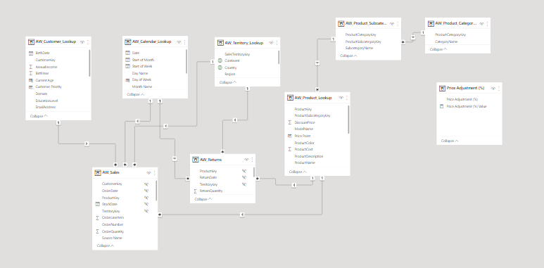
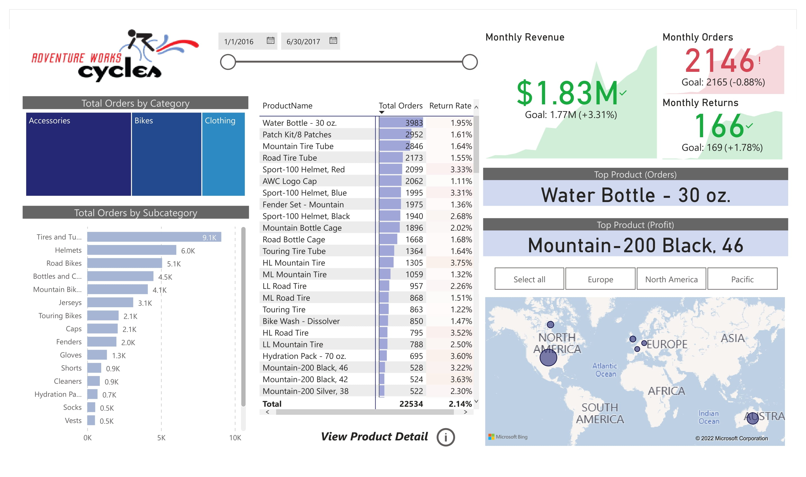
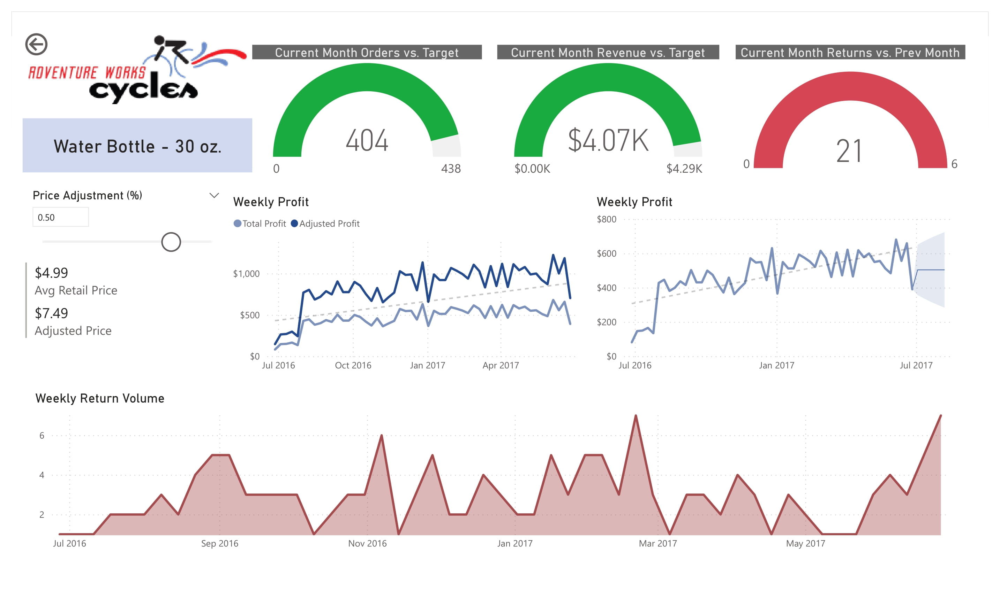
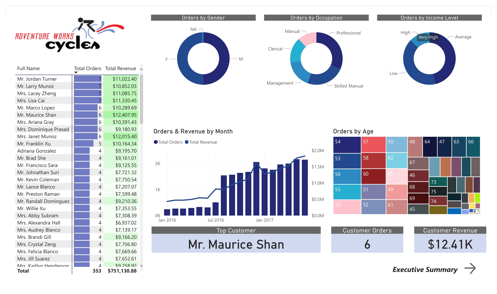

<!-- PROJECT LOGO -->
 

  

<h2 align="center">AdventureWorks-PowerBI</h2>

<!-- ABOUT THE PROJECT -->
## About The Project
AdventureWorks Database is a Microsoft product sample for an online transaction processing (OLTP) database. 
The AdventureWorks Database supports a fictitious, multinational manufacturing company called Adventure Works Cycles. 
    
Project objectives:
    
* Connect & Transform the Raw Data
* Build a Relational Data Model
* Add Calculated Fields with DAX
* Design Interactive Power BI Report

This project was made as part of the course Microsoft Power BI Desktop for Business Intelligence.

### Relational Model
 

  
  

## Dashboard
### Executive Summary
 

  
  

  
  ### Product Detail
 

  
  

  
  ### Customer Detail
 

  
  

